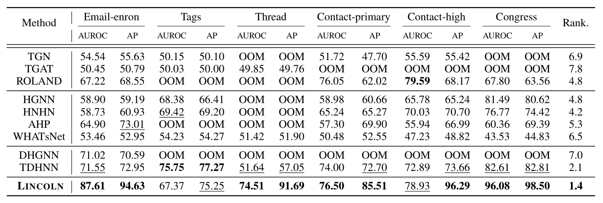

# Fixed-split setting experiment

Similar to the results shown in Table 1, LINCOLN outperforms all competing methods in most cases (i.e, achieving the best average rank). 

Interestingly, the gap between LINCOLN and other methods tends to get higher in this setting (except for TDHNN). For example, the difference between the average rank of LINCOLN and that of the
best competitor of the live-update setting (i.e., ROLAND)
becomes higher from (1.8 = 3.0−1.2) to (3.4 = 4.8−1.4).

This result implies that the live-update evaluation setting is
more practical and challenging than the fixed-split setting
since it requires for us to precisely capture the characteristics
of the evolving networks. 

Consequently, we conclude that LINCOLN is able to capture high-order dynamics of real-world networks well
by addressing the two properties of real-world networks.
