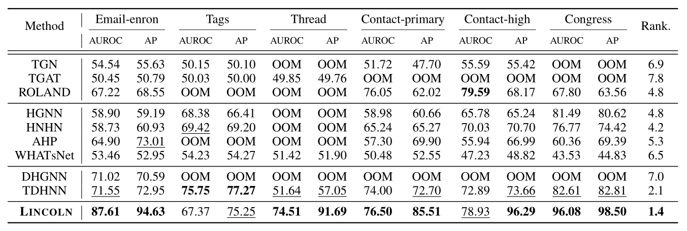
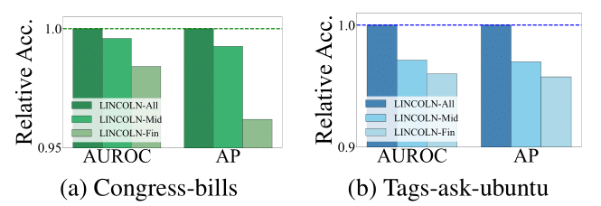

# LINCOLN: additional experiments results

## Fixed-split setting experiment

Similar to the results shown in Table 1, LINCOLN outperforms all competing methods in most cases (i.e, achieving the best average rank). 

Interestingly, the gap between LINCOLN and other methods tends to get higher in this setting (except for TDHNN). For example, the difference between the average rank of LINCOLN and that of the
best competitor of the live-update setting (i.e., ROLAND)
becomes higher from (1.8 = 3.0−1.2) to (3.4 = 4.8−1.4).

This result implies that the live-update evaluation setting is
more practical and challenging than the fixed-split setting
since it requires for us to precisely capture the characteristics
of the evolving networks. 

Consequently, we conclude that LINCOLN is able to capture high-order dynamics of real-world networks well
by addressing the two properties of real-world networks.

## Temporal feature update methods

As shown in Figure, where the y-axis represents the relative accuracy in AUROC and AP, incorporating more intermediate node embeddings into LINCOLN's inter-snapshot learning results in higher hyperedge prediction accuracy. Specifically, we evaluated three LINCOLN variants with different inter-snapshot learning designs:

LINCOLN-Fin: uses only the final node embeddings as input to the inter-snapshot learning (baseline).
LINCOLN-Mid: uses the first, third, and final node embeddings as input to the inter-snapshot learning.
LINCOLN-All: uses all intermediate node embeddings as input to the inter-snapshot learning (proposed method).

This finding demonstrates that intermediate node embeddings provide valuable information for capturing the temporal patterns of high-order relations hidden across a sequence of snapshots.

Furthermore, as shown in Table, LINCOLN consistently achieves high accuracies across most datasets, regardless of the specific variant of its temporal feature update methods. 

This result highlights the overall effectiveness of our inter-snapshot learning design, which leverages intermediate node embeddings to capture the temporal features of evolving networks, as discussed in Section 3.2. Moreover, recurrent neural network-based inter-snapshot learning (i.e., LSTM and GRU) outperform heuristic and non-recurrent neural network-based approaches, further emphasizing the strength of recurrent architectures in modeling temporal dynamics.

## Hyperparameter sensitivity

Figure shows the results, where the x-axis represents the control weight β and the y-axis represents the hyperedge prediction accuracy. 

The accuracy of LINCOLN tends to increase until β reaches around 0.4 and LINCOLN achieves the best accuracy at around 0.4. However, the accuracy of LINCOLN decreases when β is larger than 0.4 and LINCOLN
with β ≥ 1.0 shows comparable accuracy even to LINCOLN with β = 0 (i.e., the contrastive loss is not used). 

This result verifies the effectiveness of the contrastive loss that provides complementary information beneficial to LINCOLN to
learn high-order dynamics of real-world networks. However, too large β may cause the model parameters of LINCOLN to overfit the contrastive loss rather than the prediction loss.
