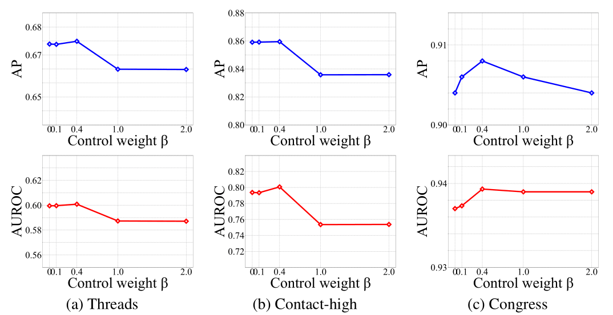

### Hyperparameter sensitivity

Figure shows the results, where the x-axis represents the
control weight β and the y-axis represents the hyperedge
prediction accuracy. 

The accuracy of LINCOLN tends to increase until β reaches around 0.4 and LINCOLN achieves the best accuracy at around 0.4. However, the accuracy of LINCOLN decreases when β is larger than 0.4 and LINCOLN
with β ≥ 1.0 shows comparable accuracy even to LINCOLN
with β = 0 (i.e., the contrastive loss is not used). 

This result verifies the effectiveness of the contrastive loss that provides complementary information beneficial to LINCOLN to
learn high-order dynamics of real-world networks. However,
too large β may cause the model parameters of LINCOLN to
overfit the contrastive loss rather than the prediction loss.