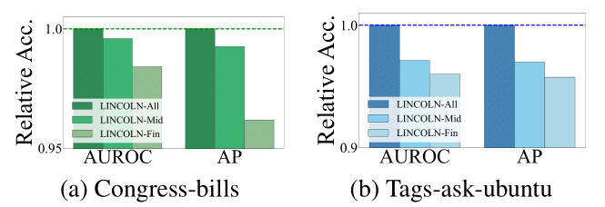

# The impact of inter-snapshot learning 

## intermediate node embedding result

As shown in Figure, where the y-axis represents the relative accuracy in AUROC and AP, incorporating more intermediate node embeddings into LINCOLN's inter-snapshot learning results in higher hyperedge prediction accuracy. Specifically, we evaluated three LINCOLN variants with different inter-snapshot learning designs:

LINCOLN-Fin: uses only the final node embeddings as input to the inter-snapshot learning (baseline).
LINCOLN-Mid: uses the first, third, and final node embeddings as input to the inter-snapshot learning.
LINCOLN-All: uses all intermediate node embeddings as input to the inter-snapshot learning (proposed method).

This finding demonstrates that intermediate node embeddings provide valuable information for capturing the temporal patterns of high-order relations hidden across a sequence of snapshots.

## temporal feature update methods

Furthermore, as shown in Table, LINCOLN consistently achieves high accuracies across most datasets, regardless of the specific variant of its temporal feature update methods. 
This result highlights the overall effectiveness of our inter-snapshot learning design, which leverages intermediate node embeddings to capture the temporal features of evolving networks, as discussed in Section 3.2. Moreover, recurrent neural network-based inter-snapshot learning (i.e., LSTM and GRU) outperform heuristic and non-recurrent neural network-based approaches, further emphasizing the strength of recurrent architectures in modeling temporal dynamics.
