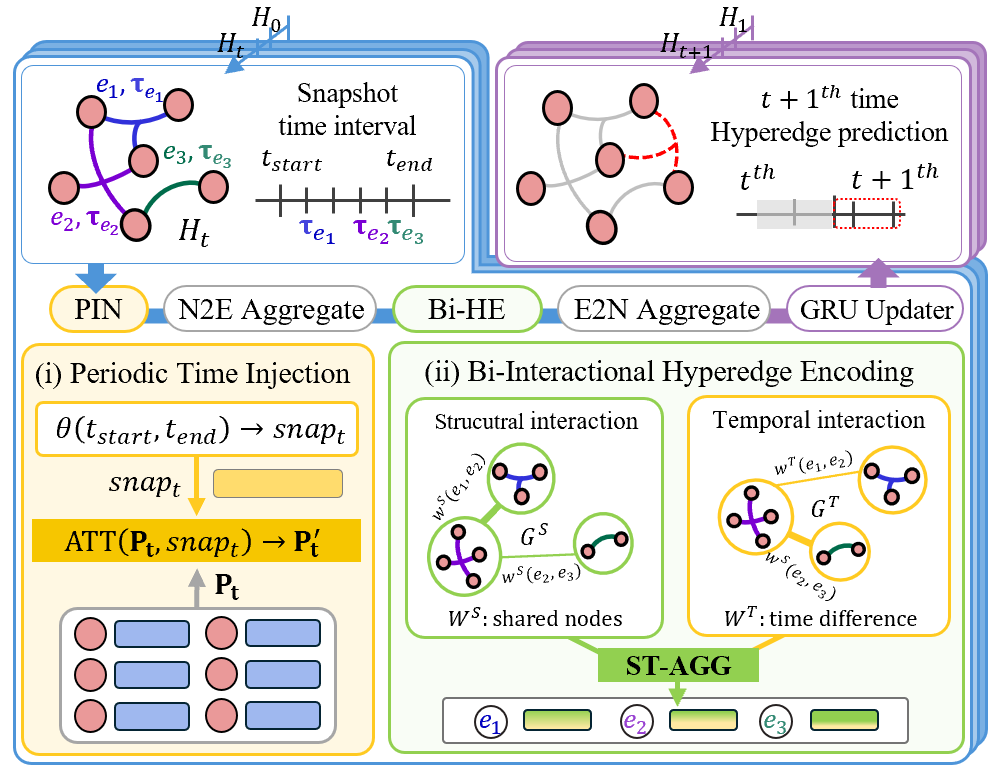

# LINCOLN: Learning High-Order Dynamics of Real-World Networks 

This repository provides an implementation of LINCOLN as described in the paper: [<u>LINCOLN: Learning High-Order Dynamics of Real-World Networks</u>](./paper.pdf) by Da Eun Lee, Song Kyung Yu, Yunyong Ko and Sang-Wook Kim.

## Overview

<p align="center">

</p>

- Observation: We observe that high-order relations tend to (O1) have a structural and temporal influence on other relations in a short term and (O2) periodically re-appear in a long term.

- Method: We propose a novel dynamic hypergraph learning method, LINCOLN, that effectively captures high-order dynamics of real-world networks by employing (1) bi-interactional hyperedge encoding and (2) periodic time injection.

- Experiments: Via extensive experiments on seven real-world datasets, we demonstrate that (1) LINCOLN outperforms nine state-of-the-art methods in the dynamic hyperedge prediction task and (2) each of the proposed strategies is effective in improving the accuracy of LINCOLN. 


## Datasets
|Name|# of nodes|# of hyperedges|Range|Snapshot frequency|# of snapshots|
|:------:|:------:|:------:|:---:|:------:|:------:|
|Email-enron|143|10,883|3 Years 5 Months|Monthly|40|
|Email-eu|979|234,760|2 Years 2 Months|Weekly|78|
|Tags|3,021|271,233|8 Years 6 Months|Monthly|86|
|Thread|90,054|192,947|7 Years 6 Months|Monthly|86|
|Contact-primary|242|106,879|32.4 Hours|Quarter of a Hour|71|
|Contact-high|327|172,035|4.2 Days|Quarter of a Hour|164|
|Congress|1,718|260,851|33 Years 6 Months|Quarter of a Year|98|

We provide 7 real-world datasets for our new benchmark task `/data/` and sampling negative samples code `/data/sampler.py`

```
# File Organization
[ dataset name ]
|__ cns_[dataset_name].pt
|__ mns_[dataset_name].pt
|__ sns_[dataset_name].pt              # negative hyperedges samples used for training and evaluation
|__ hyper_[datset_name].csv               # original hypergraph dataset
|__ new_hyper_[datset_name].csv               # reindexed hypergraph dataset
```

## Code
The source code used in the paper is available at ```./LINCOLN/```.

### Execution
```
python main.py --dataset_name [name of dataset] --snapshot_size [size of snapshot for each datset] 
```
More details about arguments are described in ```./LINCOLN/utils.py```.

### Environment
Our code runs on the Intel i7-7700k CPU with 64GB memory and  NVIDIA RTX 2080 Ti GPU, installed with CUDA 12.2 and cuDNN
8.2.1., with the following packages installed in `environment.yaml`


## Additional Result
Additional experimental results and explanations can be found [Here](Additional_Result/Readme_add.md).

###  [Fixed-split setting experiment](Additional_Result/Fixed-split.md)

We evaluate LINCOLN by using two different evaluation settings, following [ROLAND](https://arxiv.org/abs/2208.07239) : (1) fixed-split evaluation and (2) liveupdate evaluation settings. 
We compare the hyperedge prediction accuracies of LINCOLN and our competitors in the <u>fixed-split evaluation settings</u>.


### [The impact of inter-snapshot learning](Additional_Result/inter-snapshot.md)

We verify the impact of inter-snapshot learning on the hyperedge prediction accuracy of LINCOLN.

(1) We evaluated three LINCOLN variants with different inter-snapshot learning designs: *LINCOLN-Fin*: uses only the final node embeddings as input to the inter-snapshot learning (baseline). *LINCOLN-Mid*: uses the first, third, and final node embeddings as input to the inter-snapshot learning. *LINCOLN-All*: uses all intermediate node embeddings as input to the inter-snapshot learning (proposed method).

(2) Furthermore, we compare four variants of LINCOLN with different temporal feature update methods: (1) Moving average (MA); (2) Multi-layer perceptron (MLP); (3) [LSTM](https://ieeexplore.ieee.org/abstract/document/6795963), and (4) [GRU](https://arxiv.org/abs/1406.1078).


### [The impacts of the hyperparameter β](Additional_Result/hyperparameter.md)

We evaluate the impacts of the hyperparameters β on the
model accuracy of LINCOLN. We measured the accuracy of
LINCOLN with varying β (i.e., 0.0, 0.1, 0.4, 1.0 and 2.0).
